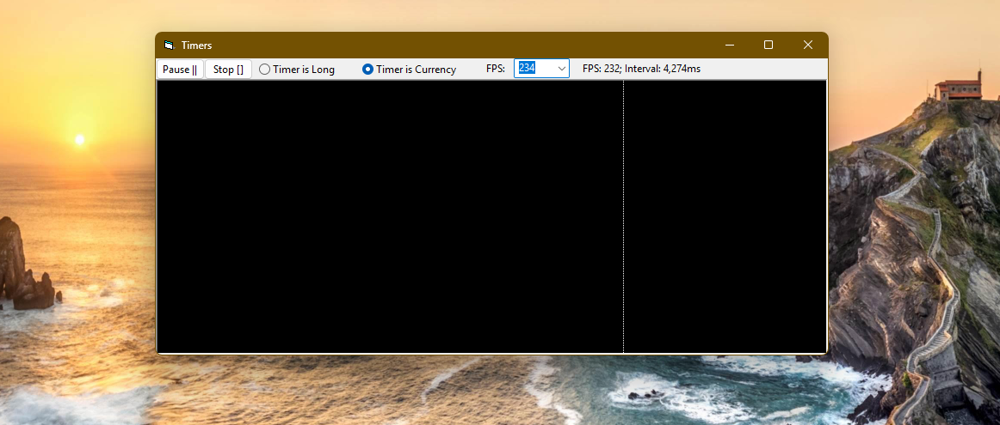
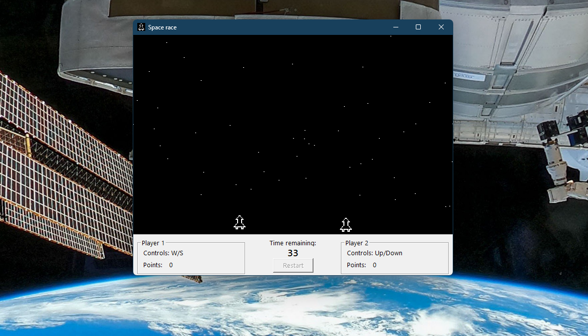

# Sys_Timers  
## Very accurate Timer for animations with a resolution of max. 1000 FPS ~ 1.0ms  
  
[](https://github.com/OlimilO1402/Sys_Timers/blob/master/LICENSE) 
[](https://github.com/OlimilO1402/Sys_Timers/releases/latest)
[](https://github.com/OlimilO1402/Sys_Timers/releases/download/v2025.4.9/Timers_v2025.4.9.zip)


Project started around 2000.  
This example shows how to do animations without a Timer control. The VBs intrinsic Timer Control has some disadvantages:  
* The Timer control is not very accurate, 
* the minimum resolution is only about 55ms, 
* it uses a windows event, so it is not very stable and 
* it does not even exist in VBA.  
  
Maybe you remember the class xTimer from ActiveVB, it tried to address this problems but had some flaws you can find it in [tipp0011!](https://www.activevb.de/tipps/vb6tipps/tipp0011.html).  
This repo contains the improved version of the XTimer class.   
In fact there are 2 classes both share the same Interface, both are interchangeable even during timer-runtime.   
* XTimerL uses the API function timeGetTime together with a locale variable of datatype Long  
* XTimer  uses the API function QueryPerformanceCounter with a locale variable of datatype Currency  
    
How does it work?   
1. It measures the time in a continuous loop, and fires when the interval is reached 
1. In every cycle the XTimer measures the time the program needs during one cycle and subtracts it from the interval. 
   By the way, this idea comes from my friend BAGZZlash, it makes the XTimer really smooth and stable.  
2. XTimer does not make use of Windows Events, instead it works with the Listener pattern.  
This is well known in the Java-world, you can do this in VB the same way, just by using an interface.  
There is the Interface "IListenXTimer" with 2 function stubs "Sub Frames(FPS)" and "Sub XTimer()".    
In other languages Interfaces start with the letter "I", some people say it is because the "I" stands for Interface.
I say, the I is not an abbreviation, in fact it's a word, it just stands for I, like me, ego, ich.  
So for the XTimer the Interface says "I Listen to XTimer" ... and I do whatever, whenever XTimer says I have to.  
Every object who wants to "listen" to XTimer-messages simply implement this interface.

```vba
Interface IListenXTimer
Public Sub XTimer()
Public Sub Frames(ByVal FPS As Long)
```

"Sub Frames" fires every second and is e.g. for displaying the frames per second, or a count-down  
"Sub XTimer" fires of course every interval.  
The "Property Interval" is of datatype Single to get or set the timer-interval in milliseconds, for this you can also use the "Property FPS".  

```vba
class XTimer
Public Property Get Interval() As Single
    'get or set the interval in milliseconds
    Interval = m_Interval
End Property
Public Property Let Interval(ByVal Value_ms As Single)
    If Value_ms <= 0 Then Value_ms = 1
    m_Interval = Value_ms
End Property
Public Property Get FPS() As Single
    'get or set the interval in terms of frames per second
    FPS = 1 / (m_Interval / 1000)
End Property
Public Property Let FPS(ByVal Value As Single)
    If Value <= 0 Then Value = 1
    m_Interval = 1000 / Value
End Property
```
what is the difference between XTimer and XTimerL?  
With the class XTimerL, if you set 450 Frames per second, it does just about 333 FPS,   
because 450 fps are 2.222 ms so it rounds up to 3 ms. Switch to the "Timer (Currency)" and it does the real 450 FPS.  
  
Maybe you also want to have a look at the repo [Sys_Stopwatch](https://github.com/OlimilO1402/Sys_StopWatch) which uses the QueryPerformance winapi either.  
  


